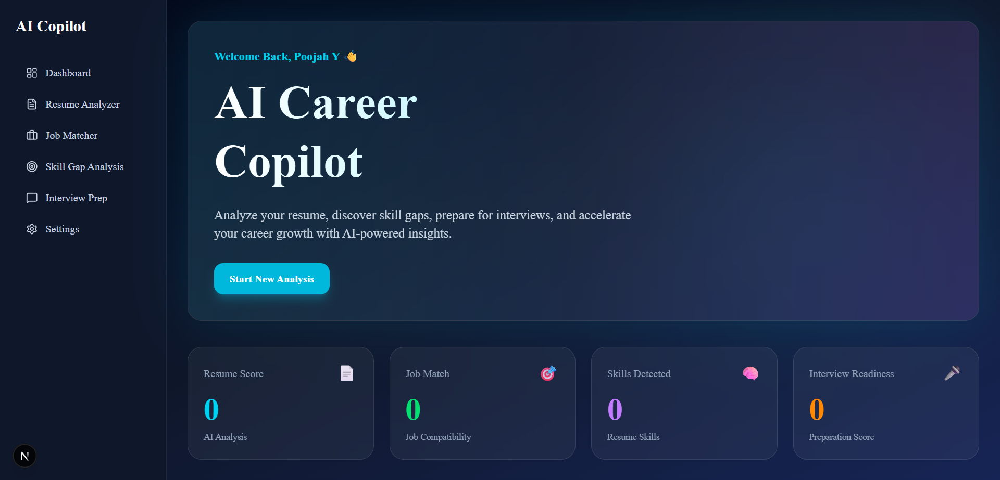
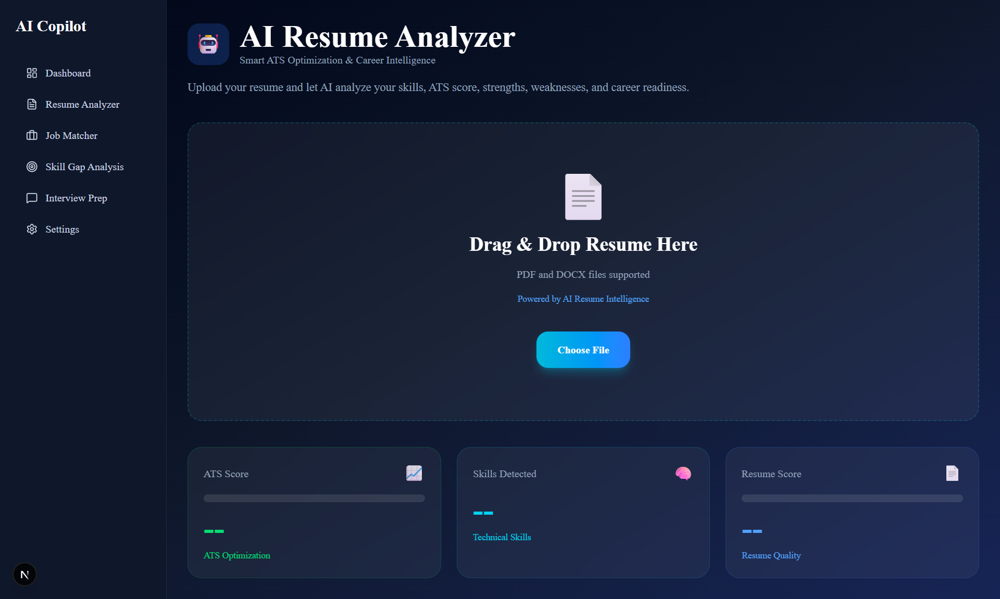
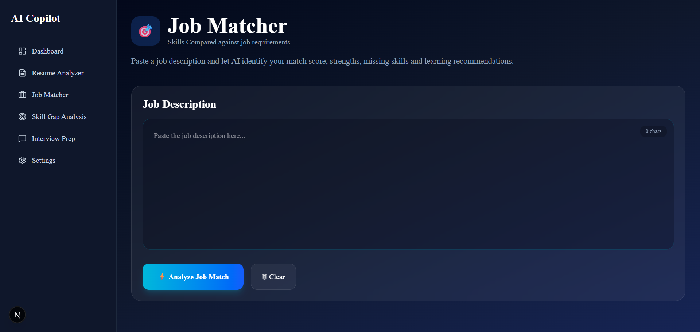
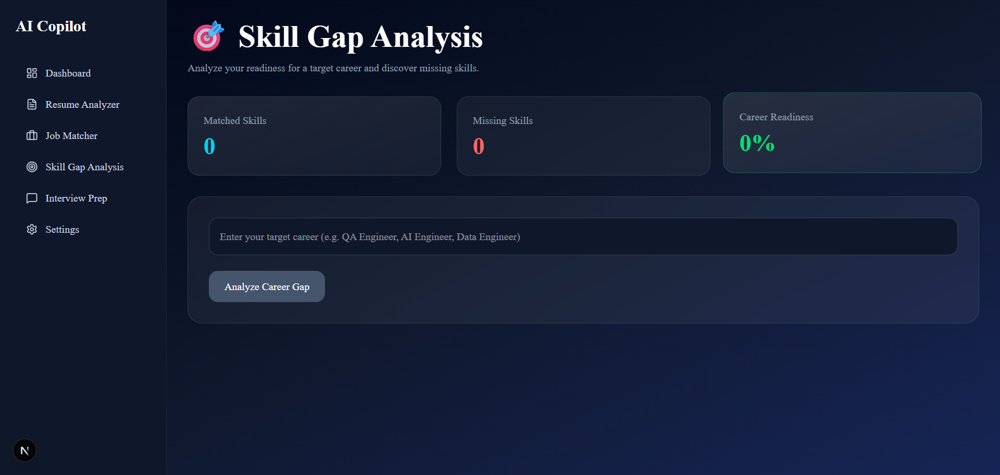
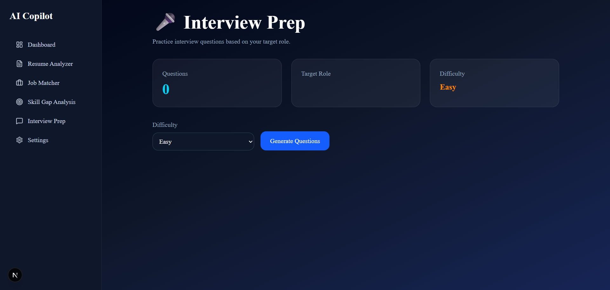
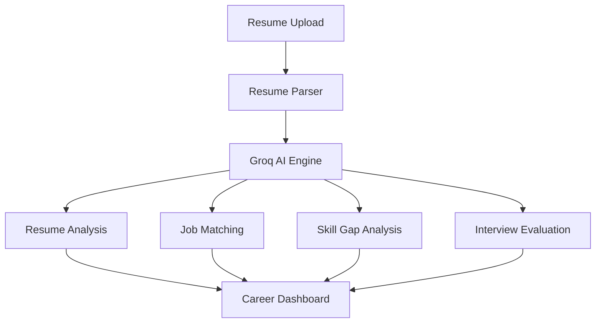

<div align="center">

# 🚀 AI Career Copilot

### AI-Powered Career Development Platform

Transform your resume into career insights with AI-driven Resume Analysis, Job Matching, Skill Gap Analysis, and Interview Preparation.

<br>


<br>

**Resume Analysis • Job Matching • Skill Gap Analysis • Interview Preparation**

</div>

---

# 🌟 Overview

AI Career Copilot is an AI-powered web platform that helps students, graduates, and job seekers understand their career readiness through intelligent resume analysis and personalized recommendations.

The platform leverages **Large Language Models (LLMs)** to evaluate resumes, compare them against job descriptions, identify missing skills, generate learning roadmaps, and simulate interview preparation.

---

# 🎥 Project Demo

[](https://youtu.be/gNZmAmHsIGc)

📺 Click the button above to watch the full project demonstration.

---

# 🎯 Problem Statement

Many job seekers struggle to answer important career questions:

- Is my resume ATS-friendly?
- Which jobs match my current skill set?
- What skills am I missing?
- How ready am I for interviews?
- What should I learn next?

AI Career Copilot addresses these challenges using AI-driven career intelligence and personalized recommendations.

---

# ✨ Key Features

| Feature | Description |
|----------|------------|
| 📄 Resume Analyzer | ATS scoring, strengths, weaknesses, and career readiness analysis |
| 🎯 Job Matcher | Match resumes against job descriptions with AI-generated scoring |
| 📈 Skill Gap Analysis | Detect missing skills and generate learning roadmaps |
| 🎤 Interview Preparation | AI-generated interview questions and answer evaluation |
| 📊 Career Readiness Dashboard | Visual analytics and performance tracking |
| ⚙️ User Settings | Personalized experience with local storage support |

---

# 📸 Application Screenshots

## Dashboard



---

## Resume Analyzer



---

## Job Matcher



---

## Skill Gap Analysis



---

## Interview Preparation



---

# 🏗️ System Architecture



---

# 🔄 Application Workflow

```text
User Uploads Resume
          ↓
Resume Text Extraction
          ↓
AI Processing (Groq LLM)
          ↓
Resume Analysis
Job Matching
Skill Gap Detection
Interview Evaluation
          ↓
Career Insights Dashboard
```

---

# 🛠️ Tech Stack

## Frontend


## AI & Backend


## Resume Processing


## State Management


## Development Tools


---

# 📊 Project Highlights

✅ AI-Powered Career Development Platform

✅ Modern Responsive Dashboard

✅ Dynamic Resume Parsing

✅ Large Language Model Integration

✅ Personalized Career Recommendations

✅ Skill Gap Identification

✅ Interview Evaluation Engine

✅ Production-Ready Architecture

---

# 📂 Project Structure

```text
src
│
├── app
│   ├── api
│   │   ├── analyze-resume
│   │   ├── job-match
│   │   ├── skill-gap-analysis
│   │   └── evaluate-interview
│   │
│   ├── resume-analyzer
│   ├── job-matcher
│   ├── skill-gap-analysis
│   ├── interview-prep
│   └── settings
│
├── components
│   ├── layout
│   └── ui
│
├── context
│
├── hooks
│
└── lib
```

---

# 🚀 Getting Started

## Clone Repository

```bash
git clone https://github.com/poojahyogarasa/ai-career-copilot.git
```

## Navigate to Project

```bash
cd ai-career-copilot
```

## Install Dependencies

```bash
npm install
```

## Configure Environment Variables

Create:

```env
.env.local
```

Add:

```env
GROQ_API_KEY=YOUR_GROQ_API_KEY
```

## Start Development Server

```bash
npm run dev
```

Open:

```text
http://localhost:3000
```

---

# 💼 Skills Demonstrated

### Software Engineering

- Full-Stack Development
- API Development
- Software Architecture
- State Management
- Component-Based Design

### AI Engineering

- Large Language Model Integration
- Prompt Engineering
- Resume Intelligence Systems
- AI-Powered Recommendations
- Natural Language Processing Workflows

### Frontend Development

- Next.js
- TypeScript
- Tailwind CSS
- Responsive Design
- UI/UX Design

### Development Practices

- Git Version Control
- Clean Code Principles
- Modular Architecture
- Reusable Components

---

# 🔮 Future Enhancements

- 🤖 AI Career Chat Assistant
- 📄 AI Cover Letter Generator
- 🔗 LinkedIn Profile Analysis
- 🎙 Voice-Based Interview Simulation
- 🌍 Multi-Language Support
- 🔐 User Authentication
- ☁ Cloud Database Integration
- 📈 Career Progress Tracking
- 🌐 Vercel Production Deployment
- 📱 Mobile Responsive Optimization

---

# 🎓 Academic Context

This project was developed as a portfolio-level AI application to demonstrate practical skills in:

- AI Integration
- Full-Stack Development
- Software Architecture
- Career Intelligence Systems
- Modern Web Technologies

---

# 👩‍💻 Author

## Poojah Yogarasa

Final-Year Undergraduate  
Department of Computer Engineering  
University of Jaffna

### Connect With Me

- GitHub: https://github.com/poojahyogarasa
- LinkedIn: https://www.linkedin.com/in/poojah-yogarasa/

---

# ⭐ Project Impact

AI Career Copilot helps students and job seekers understand their career readiness through AI-powered analysis and recommendations.

By combining modern web technologies with Large Language Models, the platform provides actionable insights that help users improve resumes, identify learning opportunities, and prepare effectively for interviews.

---
